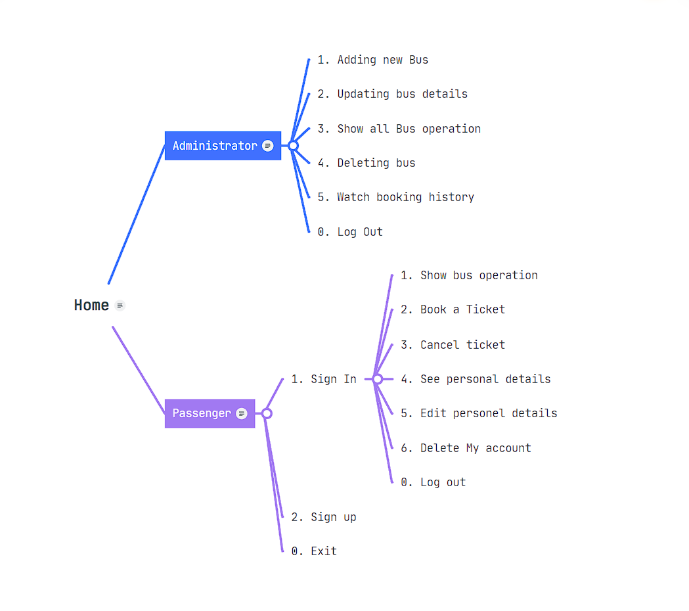

### royal-receipt-2269 (project code)
# Bus Ticket Resurvation System

# Introduction

The main objective of this project is to cater to the needs of the passenger who are
traveling from one point to another. This project contains essential modules like
Passenger and Administrator. Users can book/reserve their tickets one day before.

# Users of this application

- Administrator
- Passenger

# ER Diagram

# Flow Diagram

# Key Features

1. Administrator User
-  Add a new Bus        
-  Update bus Details    
-  Show all Bus operation      
-  Delete bus     
-  Watch booking history    
-  Log Out 

2. Passenger User
-  Sign In
-  Sign Up
-  Show buses            
-  Book Ticket             
-  Booking History          
-  Cancel booking          
-  See personel Details    
-  Edit personel details   
-  Delete My account       
-  Log Out!

# Tools & Technology used

> Java

> JDBC

> MySql

> Spring Tool Suite 4.0

> Github

# For Detailed Explanation

<a href="https://drive.google.com/file/d/1MZrkSJZufL4ewJXoQzmdEP44kPxNruy_/view?usp=sharing" >Click here</a>

# Thanks For Reading
